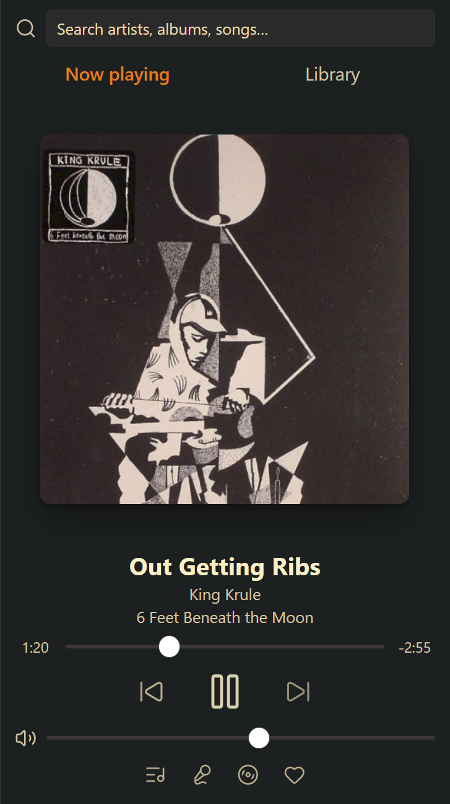
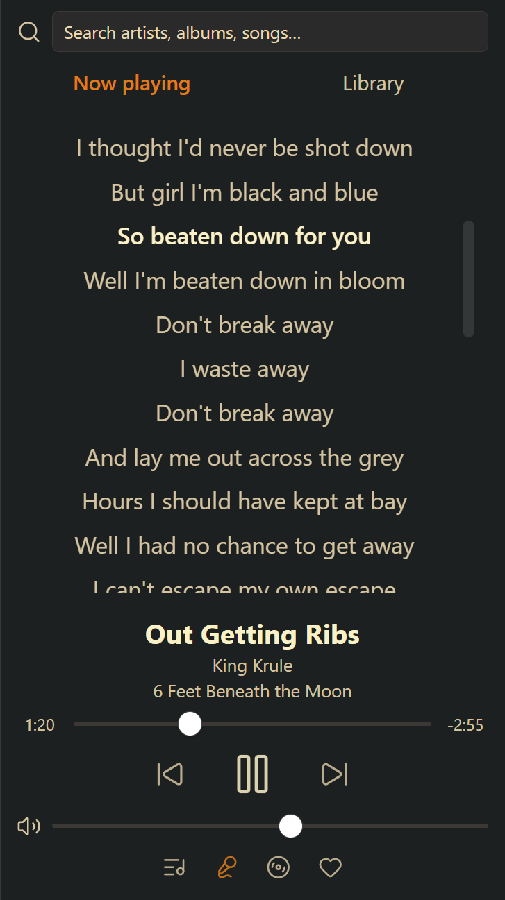
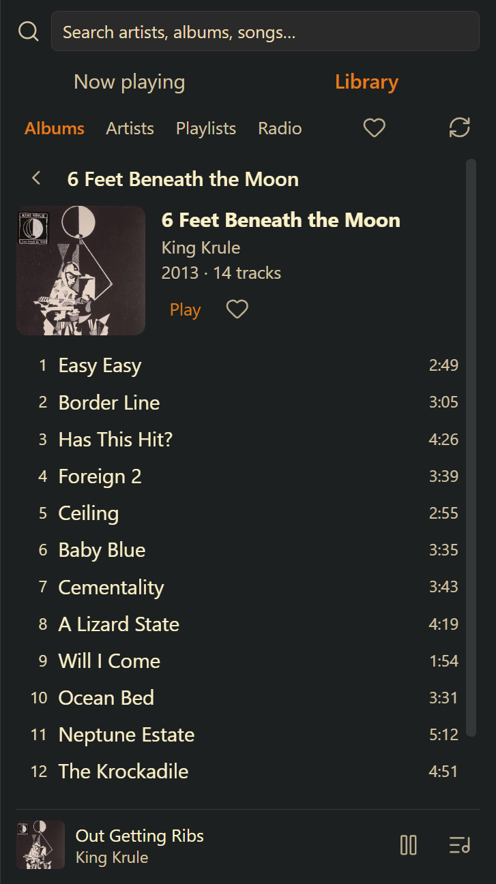
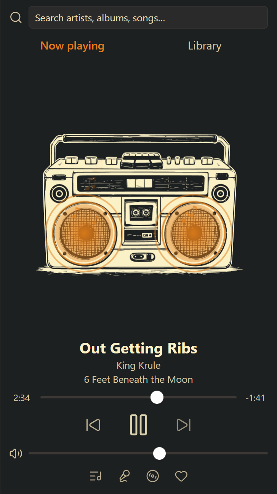
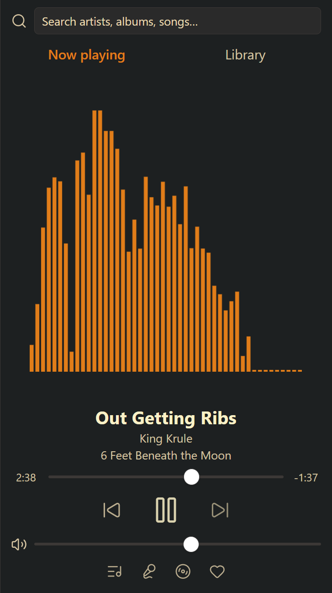
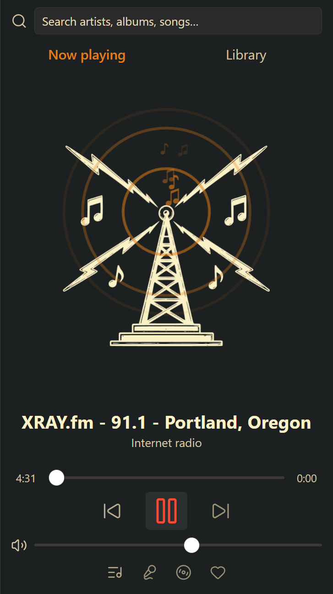

# Stereo

Stream music from your Navidrome or Subsonic-compatible server inside Obsidian.
Stereo is a full music player in the sidebar: browse your library, queue albums,
run stations, read synced lyrics, and keep the music going while you work in
your notes.

<p align="center">
  
  
  
</p>
<p align="center">
  
  
  
</p>

## Features

**Player**
- Now Playing view with selectable art treatments: album art, spinning record,
  or audio-reactive visualizers.
- Full transport (seek, previous/next, volume) with a compact mini player that
  takes over when you navigate elsewhere.
- Lyrics with follow-along highlighting for synced lyrics — click a line to
  seek. Plain lyrics scroll normally.
- Feeling lucky? A dice button plays a random song from your library.
- Media keys and the system playback overlay control Stereo and show the
  current track.
- Scrobbles plays back to your server so play counts stay accurate.

**Library**
- Recently played lists the latest 200 song plays, newest first. Use the history
  icon in Library to play a track again, add it to the queue, or clear history.
- Browse albums, artists, playlists, and internet radio, with drill-in
  navigation (artist → album → track) and an A–Z scrubber for long lists.
- Right-click context menus everywhere: play, play next, add to queue, go to
  artist/album, favorite, start station.
- Favorites synced with your server — heart tracks, albums, and artists from
  the player, menus, or detail pages, and browse them all on a Favorites page.
- Manage internet radio stations from the player: add, edit, and remove
  (requires an admin account on the server).

**Queue & stations**
- Full-page queue with playback modes, save-as-playlist, and persistence across
  Obsidian restarts.
- Repeat control beside shuffle cycles through off, queue, and track. The choice
  survives restarts; Next skips ahead even with repeat track. Live radio does not repeat.
- Drag tracks to reorder, or right-click a queue entry to move it next without
  interrupting playback. Duplicate entries can be moved independently.
- Undo the last queue clear or replacement, including station changes. Undo
  lasts until another queue edit or plugin restart.
- Stations: seed from any song, album, or artist to build a batch of similar
  tracks, then extend it or save it as a playlist.

**Search**
- As-you-type fuzzy search across artists, albums, and tracks.

## Setup

1. Install and enable the plugin.
2. Open **Settings → Stereo** and enter your server URL, username, and
   password.
3. Use **Test connection** to confirm the server is reachable, then open the
   player from the ribbon icon or the **Open player** command.

Settings also cover track click behavior, Now Playing view, lyrics font,
and search tuning.

## Requirements

- Obsidian desktop (this plugin is desktop-only).
- A server that speaks the Subsonic API — Navidrome, Airsonic-Advanced, Gonic,
  and others.

## Data and network transparency

- Music playback, browsing, favorites, scrobbling, and station building talk
  **only** to the server URL you configure. Nothing is sent anywhere until you
  configure a server.
- Lyrics are fetched from your server first; if your server has none for the
  current track, Stereo queries [LRCLIB](https://lrclib.net) (a free, public
  lyrics database) with the track's title, artist, album, and duration. No
  account data is sent.
- Your server URL, username, and **password are stored in plain text** in
  `.obsidian/plugins/stereo/data.json` inside your vault. If you sync or share
  your vault, that file goes with it. Consider a dedicated, limited account on
  your music server.
- No telemetry, no analytics.
- Recently played stores track IDs, display metadata (title, artist, album,
  artwork ID, genre, duration, and favorite status), and play timestamps locally
  in the same `data.json`, limited to 200 entries for the configured
  server/account. History records actual song starts, including replays and
  repeats, and excludes radio. It contains no passwords or authenticated
  stream/artwork URLs. Clear history removes these entries without changing
  playback or the queue. Changing the server URL or username clears history and
  the previous account's queue/undo once you leave the field.
  There is no background history import or cloud history sync feature; vault
  syncing can copy `data.json` along with your other vault files.

## Development

```bash
npm install
npm run dev    # watch build
npm run build  # type-check + production build
npm test       # playback store regression tests
```

## Support

If you enjoy Stereo, you can [buy me a coffee](https://buymeacoffee.com/romanmurray).

## License

[GPL-3.0](LICENSE)
